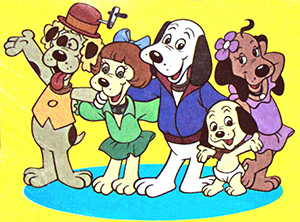

# Canil
Solução de um problema de lógica em linguagem python.
O problema foi proposto pela empresa de tecnologia **[DTI DIGITAL](https://www.dtidigital.com.br/)**.

Para mais detalhes acesse o pdf clicando [aqui](https://drive.google.com/file/d/1Fljvvz29Gs0uOXgTkOuHooR7lJCpPwiD/view?usp=sharing).
 
Para acessar o meu currículo virtual clique [aqui](https://www.dtidigital.com.br/).

Para acessar o meu github clique [aqui](https://github.com/PierreVieira).

